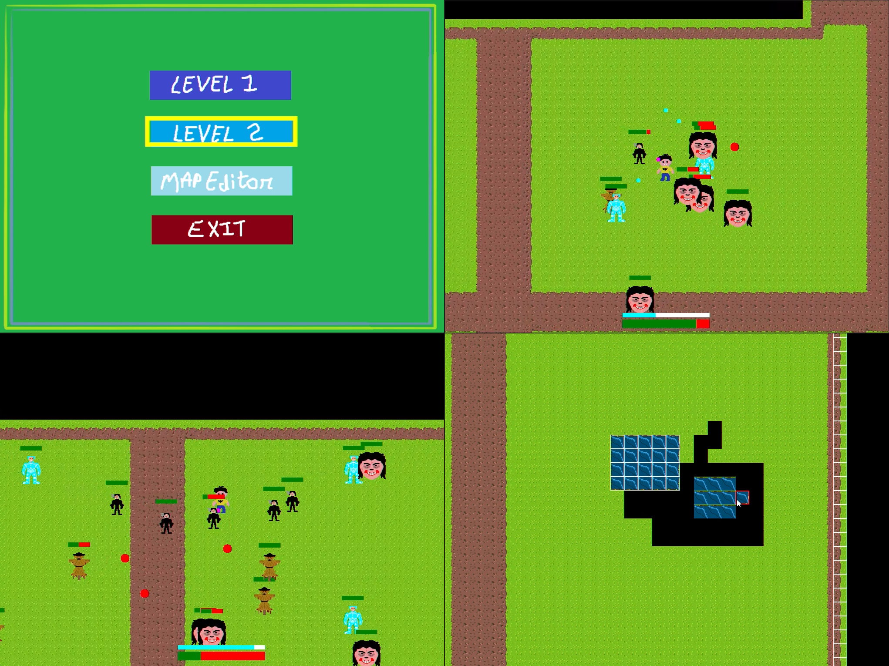
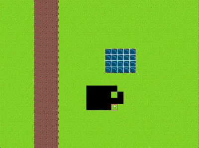
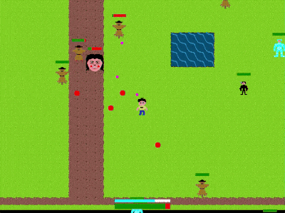

# Vampire Survival

## 📌 About

This project is a 2D vampire survival like game made from scratch using C++ and DirecX11 during my MSc in Games Engineering. It implements several game system like character movement, collision system, simple NPCs with different types. 

Aim of this project was to learn modern C++ concepts like templates and lambda functions using Visual Studio. 

This project uses [GamesEngineeringBase.h](https://github.com/MSCGamesTom/GamesEngineeringBase). 

  

  
  

## ⌨️ Controlles

### Game
- WASD to move
- Space for area attack

### Level Editor
- WASD to move
- P to save
- Scroll to change Tile
- Left Click to place and Right Click to remove Tile
- Space to change Tile Mode (Solid or Pass through)
- Q and E to decrease or increase move speed respectively
